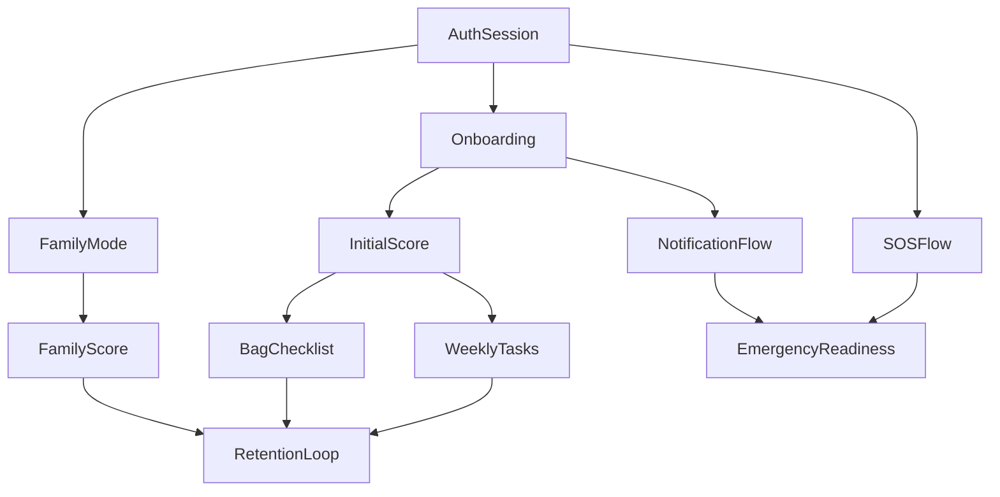

# Deprem Hazirlik Uygulamasi - Uygulama Plani V2 (MVP v1)

## 1) Amac

- Bu plan, mevcut `plan.md` dosyasindan farkli olarak delivery sirasini teknik katmanlara gore degil, kullaniciya dogrudan deger ureten dikey urun dilimlerine gore kurar.
- Hedef, en erken asamada calisan bir cekirdek deneyim cikarmak; sonrasinda retention, aile koordinasyonu ve acil durum guvenilirligini asamali olarak guclendirmektir.

## 2) Kapsam Karari

### 2.1 Dahil (MVP v1 - frozen)
- Kimlik dogrulama (OTP)
- Onboarding
- Hazirlik skoru
- Haftalik gorevler
- Deprem cantasi
- Aile modu
- Offline acil rehber
- SOS butonu
- Bildirimler

### 2.2 Haric (v2+)
- Erken deprem uyari sistemi
- Bina dayaniklilik analizi
- DASK entegrasyonu
- AI chatbot
- Web uygulamasi

### 2.3 Kapsam Koruma Kurali
- Yeni gelen her is kalemi `MVP` veya `v2+` olarak etiketlenir.
- `v2+` etiketli hicbir is aktif sprint backlog'una alinmaz.

## 3) Teslim Stratejisi

Bu plan 4 teknik milestone yerine 4 urun dilimine ayrilir:

1. Ilk deger dilimi: kullanici giris yapar, onboarding'i tamamlar, ilk skorunu gorur.
2. Devamlilik dilimi: kullanici haftalik gorev ve canta ilerlemesiyle skorunu artirir.
3. Aile koordinasyon dilimi: kullanici aile daveti gonderir, aile skorunu gorur.
4. Acil durum dilimi: kullanici internet yokken rehbere ulasir ve SOS tetikleyebilir.

## 4) Slice 1 - Ilk Deger Akisi (Hafta 1-2)

### Hedef
- Ilk acilista kullanici 90 saniye icinde uygulamaya girsin, profilini olustursun ve ilk skor ekranini gorsun.

### Kapsam
- `FR-AUTH-01..05`
- `NFR-AUTH-01..02`
- `FR-ONB-01..12`
- Skor motorunun saf fonksiyon cekirdegi baslangicta butun olarak kurulur; Slice 1'de ilk skor gosterimi acilir, Slice 2'de gorev/canta eventleri bu motora baglanir

### Teslimatlar
- OTP auth ve oturum yonetimi
- Secure storage ile token saklama
- 3 adimli onboarding akisi
- Profil olusturma ve ilk skor gorunumu
- Skor motoru cekirdeginin saf fonksiyon olarak kurulmasi
- Analitik event altyapisinin kurulmasi (ozellikle auth, onboarding ve ilk skor event'leri)
  - `auth_otp_sent`
  - `auth_otp_verified`
  - `onboarding_step_1_completed`
  - `onboarding_step_2_completed`
  - `onboarding_step_3_completed`
  - `first_score_viewed`
- Bildirim izninin onboarding icinde istenmesi (`FR-ONB-11`); bildirimlerin tam zamanlama ve deep link davranislarinin ise Slice 4'te tamamlanmasi

### Cikis Kriterleri
- OTP ile oturum aciliyor
- Onboarding tekrar gosterilmiyor
- Kullanici ilk skorunu goruyor

## 5) Slice 2 - Skor Artisi ve Retention (Hafta 3-4)

### Hedef
- Kullanici her hafta geri donmesini saglayacak ilerleme mekanigini hissetsin.

### Kapsam
- `FR-SCR-03..06`
- `NFR-SCR-01..02`
- `FR-TSK-01..08`
- `FR-BAG-01..07`

### Teslimatlar
- Skor motorunun tam hesap mantigi
- Gorev setleri, puanlama ve tamamlanma davranisi
- Canta checklist ve profil odakli ek maddeler
- Gorev/canta eventlerinden skora geri besleme
- Izin durumunu canli tutmak ve akisi erken dogrulamak icin en az bir test/ilk gorev bildiriminin gonderilmesi

### Cikis Kriterleri
- Gorev ve canta degisiklikleri skoru aninda etkiliyor
- Tamamlanan gorevler geri alinamiyor
- Offline durumda gorev/canta goruntuleme suruyor

## 6) Slice 3 - Aile ve Viral Buyume (Hafta 5-6)

### Hedef
- Tekil kullanimdan aile koordinasyonuna gecis yaparak viral buyumeyi test etmek.

### Kapsam
- `FR-FAM-01..10`
- `FR-SCR-04` ile aile skorunun skor motoruna etkisi
- Davet/deep link ve 5 kisi limiti

### Teslimatlar
- Aile olusturma ve katilim akislari
- Deep link veya davet kodu ile giris
- Aile dashboard'u ve en zayif halka vurgusu
- Aile skoru guncelleme akisi

### Cikis Kriterleri
- Aile olusturma, davet ve katilim akisleri tamam
- Aile dashboard'u guncel skorleri gosteriyor
- En zayif halka vurgusu dogru calisiyor

## 7) Slice 4 - Acil Durum ve Dayaniklilik (Hafta 7-8)

### Hedef
- Uygulamanin gercek kriz aninda minimum bagimlilikla calisabildigini gostermek.

### Kapsam
- `FR-GDE-01..06`
- `FR-SOS-01..08`
- `FR-NOT-01..06`
- PRD bolum 8 edge-case senaryolari
- PRD bolum 10-11 performans ve kabul hedefleri

### Teslimatlar
- Offline rehber
- SOS onay, retry ve fallback davranisi
- Bildirim zamanlama ve deep link akislari
- UAT ve stabilizasyon kapanislari

### Cikis Kriterleri
- Rehber ucak modunda tam aciliyor
- SOS fallback/retry davranisi calisiyor
- Bildirimler dogru ekranlara deep link ile gidiyor

## 8) Yurutme Prensipleri

- Her slice sonunda kullaniciya gosterilebilir bir demo olmali.
- Her yeni ozellikte once lokal veri/akis, sonra sync entegrasyonu yapilmali.
- Guvenlik ve KVKK kontrolleri sona birakilmamali; her slice icinde tamamlanmali.
- PII loglama yasak; telefon ve konum debug log'larinda maskelenmeli.

## 9) Oncelikli Teknik Temeller

- Auth + secure storage
- Lokal DB ve temel schema
- Skor motoru saf fonksiyon yapisi
- Deep link routing
- Retry/log altyapisi (SOS ve sync icin)
- Analitik event altyapisi (PostHog event semasi, temel funnel event'leri, anonim kimlikleme)

## 10) Deployment ve Geri Alma Stratejisi

- Her slice sonunda ozellikler dogrudan tum kullanicilara acilmaz; once kontrollu beta grubunda dogrulanir.
- Riskli moduller (ozellikle aile modu, bildirimler, SOS ile ilgili uzaktan davranislar) mumkun oldugunca feature flag veya uzaktan konfigurasyon ile acilip kapatilabilir tasarlanir.
- Production'da surum geri cekme son caredir; birincil kontrol mekanizmasi feature flag veya uzaktan konfigurasyondur.
- Bir slice'ta kritik hata cikarsa iki geri alma secenegi uygulanir:
  - Ozellik kapatma: feature flag ile ilgili akis gecici olarak devre disi birakilir
  - Surum geri cekme: gerekli durumda onceki stabil build'e donulur
- Slice bazli release notu tutulur; her beta acilisinda bilinen riskler ve rollback karari kayda gecirilir

## 11) Bagimlilik Akisi



## 12) Riskler

- OTP veya SMS saglayici gecikmesi
  - Mock + retry + timeout gozlemi ile erken test
- Offline-sync cakismasi
  - Queue ve last-write-wins davranisini erken netlestirme
- Aile modu karmasikligi
  - Once tek lider + sinirli uye modeliyle baslama
- Bildirim yorgunlugu
  - Ilk surumde yalnizca PRD'deki 3 cekirdek bildirim senaryosunu acik tutma
- Canliya cikan ozellikte kirik akis riski
  - Feature flag ve kontrollu beta rollout ile etkisini sinirlama

## 13) Definition of Done

Her modulde asagidaki 6 kosulun tamami saglanmadan `done` sayilmaz:

1. Ilgili FR/NFR maddeleri karsilanmis
2. Unit testleri yesil (cekirdek hesap/karar mantigi)
3. Entegrasyon testi yesil (ekranlar arasi veya servis arasi akis)
4. En az 1 edge-case testi gecmis
5. Guvenlik/KVKK checklist'i gecmis (PII log kontrolu dahil)
6. PR aciklamasinda test plani ve risk notu bulunuyor

## 14) Validation Checkpoints

### 14.1 Weekly Technical Checkpoint
- Skor hesaplama suresi (P99)
- Skor sync gecikmesi (P95)
- Offline rehber acilis suresi (P99)
- Crash-free oran (7 gunluk ortalama)
- SOS teslim gecikmesi (P95)

### 14.2 Sprint-End Product Checkpoint
- Onboarding tamamlama suresi ve drop-off adimlari
- Haftalik gorev tamamlama oranlari
- Aile davet donusum orani
- Bildirim tiklama oranlari

### 14.3 Beta/UAT Gate
- `UAT-01..05` kriterleri dogrulanir
- Kritik hatalar: 0 blocker, max dusuk seviye acik issue
- MVP basari metrikleri icin ilk trendler olculmeye baslanmis olmali
- Bu gate kriterleri saglanmazsa genel yayin karari minimum 1 hafta ertelenir; oncelik blocker ve kabul kriteri eksiklerinin kapatilmasina verilir.

### 14.4 Release Takvimi
- Slice 1 sonu: internal beta (10 kisi)
- Slice 2 sonu: closed beta (50 kisi)
- Slice 4 sonu: genel yayin adayi / production release karari

## 15) Olcum ve Karar Noktalari

- Slice 1 sonu
  - Onboarding tamamlama ve auth basari orani
  - Analitik funnel event'lerinin eksiksiz aktigi dogrulanir
- Slice 2 sonu
  - Gorev tamamlama ve skor degisimi
  - Ilk test bildiriminin teslim ve tiklanma davranisi gozlemlenir
- Slice 3 sonu
  - Davet gonderme ve aile katilim donusumu
- Slice 4 sonu
  - `UAT-01..05`, crash-free oran, offline rehber ve SOS basari metrigi

## 16) Onerilen Ilk Uygulama Sirasi

1. Auth + local persistence
2. Onboarding + ilk skor
3. Gorevler + canta
4. Aile modu
5. Offline rehber + SOS
6. Bildirimler + UAT + performans kapanisi

## 17) Onerilen Proje Iskelet Haritasi

Bu iskelet, Expo tabanli mobil uygulama akislarini `frontend/` altinda; sunucu, senkronizasyon ve edge function ihtiyaclarini ise `backend/` ve `supabase/` altinda ayirmayi onerir.

```text
frontend/
  app/
    (auth)/
      otp.tsx
      verify.tsx
    (onboarding)/
      region.tsx
      profile.tsx
      first-score.tsx
    (main)/
      index.tsx
      tasks.tsx
      bag.tsx
      family.tsx
      emergency.tsx
      settings.tsx
    _layout.tsx
  src/
    core/
      score-engine.ts
      auth.ts
      notifications.ts
      constants.ts
    db/
      schema.ts
      migrations/
      models/
        user-profile.ts
        task.ts
        bag-item.ts
        family-member.ts
        sos-log.ts
    services/
      supabase.ts
      netgsm.ts
      analytics.ts
      guide-sync.ts
      deep-links.ts
    stores/
      auth-store.ts
      score-store.ts
      task-store.ts
      family-store.ts
      settings-store.ts
    hooks/
      useAuth.ts
      useOnboarding.ts
      useTasks.ts
      useBag.ts
      useFamily.ts
      useEmergency.ts
    components/
      common/
      score/
      tasks/
      bag/
      family/
      emergency/
    content/
      emergency-guide/
    types/
      auth.ts
      score.ts
      task.ts
      family.ts
      api.ts
backend/
  src/
    functions/
      send-sms/
        index.ts
      sync-profile/
        index.ts
      sync-score/
        index.ts
      family-invite/
        index.ts
      notification-dispatch/
        index.ts
    services/
      auth-service.ts
      family-service.ts
      score-sync-service.ts
      notification-service.ts
      sms-service.ts
      analytics-service.ts
    contracts/
      auth.ts
      family.ts
      notification.ts
      score.ts
    jobs/
      weekly-task-refresh.ts
      notification-scheduler.ts
    lib/
      env.ts
      logger.ts
      errors.ts
    tests/
      integration/
      contract/
supabase/
  migrations/
  seed/
  functions/
    send-sms/
    sync-profile/
    sync-score/
    family-invite/
    notification-dispatch/
  policies/
  types/
```

### Iskelet Notlari

- `frontend/app/` ekran ve route seviyesini tasir; agir is kurallari burada tutulmaz.
- `frontend/src/core/score-engine.ts` saf fonksiyon cekirdegi olarak tasarlanir; Slice 1'de kurulur, Slice 2'de gorev ve canta olaylari bu motora baglanir.
- `frontend/src/db/` WatermelonDB schema, migration ve modelleri barindirir.
- `frontend/src/services/analytics.ts` Slice 1 funnel event'lerini, `frontend/src/services/netgsm.ts` SOS SMS akislarini, `frontend/src/services/supabase.ts` auth ve senkronizasyonu kapsar.
- `frontend/src/stores/` Zustand slice yapisina gore ayrilir; gecici ekran state'i store'a tasinmaz.
- `frontend/src/content/emergency-guide/` offline rehber iceriginin bundle/fallback versiyonlarini tutmak icin ayrilmistir.
- `backend/src/functions/` ve `supabase/functions/` uzaktan calisan edge function veya API giris noktalarini temsil eder; davet, sync, SMS ve notification dispatch gibi riskli akislar burada izole edilir.
- `backend/src/contracts/` istemci-sunucu veri sekillerini sabitler; request/response kirilmalari burada izlenir.
- `supabase/migrations/` ve `supabase/policies/` veritabani semasi ile Row Level Security kurallarini birlikte version'lar.
